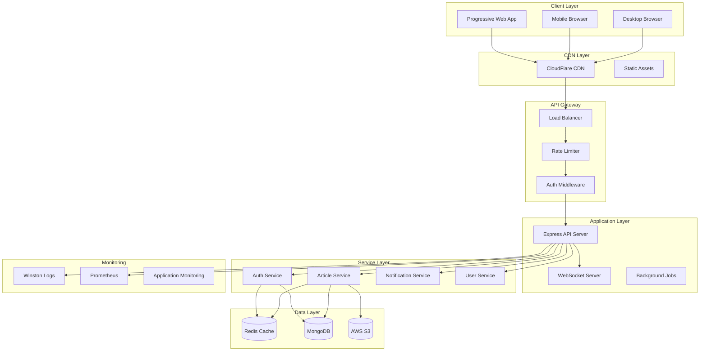

# Design Document - Blog App Architecture Improvements

## Overview

This design document outlines the technical architecture and implementation strategy for transforming the existing DevBlog platform into a production-ready, scalable application. The design follows Domain-Driven Design (DDD) principles, implements modern security practices, and ensures optimal performance and maintainability.

The improvements will be implemented in three phases:
- **Phase 1 (Months 1-3):** Foundation - Architecture refactoring, security, testing
- **Phase 2 (Months 4-6):** Performance - Optimization, monitoring, caching
- **Phase 3 (Months 7-12):** Scale - Advanced features, PWA, DevOps automation

## Architecture

### High-Level Architecture



### Backend Architecture Redesign

#### Domain-Driven Design Structure

```
server/
├── src/
│   ├── domains/
│   │   ├── auth/
│   │   │   ├── controllers/
│   │   │   │   ├── AuthController.js
│   │   │   │   └── index.js
│   │   │   ├── services/
│   │   │   │   ├── AuthService.js
│   │   │   │   ├── TokenService.js
│   │   │   │   └── index.js
│   │   │   ├── repositories/
│   │   │   │   ├── UserRepository.js
│   │   │   │   └── index.js
│   │   │   ├── validators/
│   │   │   │   ├── authSchemas.js
│   │   │   │   └── index.js
│   │   │   ├── routes/
│   │   │   │   └── authRoutes.js
│   │   │   └── index.js
│   │   ├── articles/
│   │   │   ├── controllers/
│   │   │   ├── services/
│   │   │   ├── repositories/
│   │   │   ├── validators/
│   │   │   └── routes/
│   │   ├── notifications/
│   │   └── users/
│   ├── shared/
│   │   ├── middleware/
│   │   │   ├── auth.js
│   │   │   ├── validation.js
│   │   │   ├── errorHandler.js
│   │   │   └── rateLimit.js
│   │   ├── utils/
│   │   │   ├── ApiResponse.js
│   │   │   ├── Logger.js
│   │   │   ├── Cache.js
│   │   │   └── Database.js
│   │   ├── types/
│   │   │   └── common.js
│   │   └── constants/
│   │       └── index.js
│   ├── config/
│   │   ├── database.js
│   │   ├── redis.js
│   │   ├── security.js
│   │   └── environment.js
│   └── app.js
├── tests/
│   ├── unit/
│   ├── integration/
│   └── e2e/
└── docs/
    └── api/
```

#### Repository Pattern Implementation

```javascript
// Base Repository
class BaseRepository {
  constructor(model) {
    this.model = model;
  }

  async findById(id, options = {}) {
    const { populate, select } = options;
    let query = this.model.findById(id);
    
    if (populate) query = query.populate(populate);
    if (select) query = query.select(select);
    
    return query.lean();
  }

  async findWithPagination(filters = {}, options = {}) {
    const { 
      page = 1, 
      limit = 10, 
      sort = { createdAt: -1 },
      populate,
      select 
    } = options;

    let query = this.model.find(filters);
    
    if (populate) query = query.populate(populate);
    if (select) query = query.select(select);
    
    const [data, total] = await Promise.all([
      query
        .sort(sort)
        .skip((page - 1) * limit)
        .limit(limit)
        .lean(),
      this.model.countDocuments(filters)
    ]);

    return {
      data,
      pagination: {
        page,
        limit,
        total,
        pages: Math.ceil(total / limit)
      }
    };
  }
}

// Article Repository
class ArticleRepository extends BaseRepository {
  constructor() {
    super(Article);
  }

  async findPublishedArticles(filters = {}, options = {}) {
    return this.findWithPagination(
      { ...filters, status: 'published' },
      {
        ...options,
        populate: 'author',
        select: '-content' // Exclude full content for list views
      }
    );
  }

  async findBySlug(slug) {
    return this.model
      .findOne({ slug })
      .populate('author', 'name username image')
      .lean();
  }

  async incrementLikes(articleId, userId) {
    return this.model.findByIdAndUpdate(
      articleId,
      { 
        $addToSet: { likes: userId },
        $inc: { likesCount: 1 }
      },
      { new: true }
    );
  }
}
```

#### Service Layer Design

```javascript
// Article Service
class ArticleService {
  constructor(articleRepository, cacheService, notificationService) {
    this.articleRepository = articleRepository;
    this.cacheService = cacheService;
    this.notificationService = notificationService;
  }

  async createArticle(articleData, authorId) {
    // Validate data
    const validatedData = ArticleSchema.parse(articleData);
    
    // Generate slug
    const slug = this.generateSlug(validatedData.title);
    
    // Create article
    const article = await this.articleRepository.create({
      ...validatedData,
      author: authorId,
      slug
    });

    // Invalidate cache
    await this.cacheService.invalidatePattern('articles:*');
    
    // Send notifications to followers
    await this.notificationService.notifyFollowers(authorId, {
      type: 'new_article',
      articleId: article._id
    });

    return article;
  }

  async getArticles(filters, options) {
    const cacheKey = `articles:${JSON.stringify({ filters, options })}`;
    
    // Try cache first
    let result = await this.cacheService.get(cacheKey);
    
    if (!result) {
      result = await this.articleRepository.findPublishedArticles(filters, options);
      await this.cacheService.set(cacheKey, result, 300); // 5 minutes
    }
    
    return result;
  }

  async likeArticle(articleId, userId) {
    const article = await this.articleRepository.incrementLikes(articleId, userId);
    
    // Invalidate cache
    await this.cacheService.invalidate(`article:${articleId}`);
    
    // Send notification to author
    await this.notificationService.create({
      recipient: article.author,
      sender: userId,
      type: 'like',
      articleId
    });

    return article;
  }
}
```

### Frontend Architecture Enhancement

#### Atomic Design Structure

```
client/src/
├── components/
│   ├── atoms/
│   │   ├── Button/
│   │   │   ├── Button.jsx
│   │   │   ├── Button.test.jsx
│   │   │   ├── Button.stories.jsx
│   │   │   └── index.js
│   │   ├── Input/
│   │   ├── Icon/
│   │   └── Typography/
│   ├── molecules/
│   │   ├── SearchBar/
│   │   ├── CommentItem/
│   │   ├── ArticleCard/
│   │   └── UserAvatar/
│   ├── organisms/
│   │   ├── Navbar/
│   │   ├── ArticleList/
│   │   ├── CommentSection/
│   │   └── NotificationDropdown/
│   ├── templates/
│   │   ├── PageLayout/
│   │   ├── AuthLayout/
│   │   └── DashboardLayout/
│   └── pages/
│       ├── HomePage/
│       ├── ArticlePage/
│       └── ProfilePage/
├── hooks/
│   ├── useApi.js
│   ├── useAuth.js
│   ├── useSocket.js
│   └── useInfiniteScroll.js
├── stores/
│   ├── authStore.js
│   ├── articleStore.js
│   ├── notificationStore.js
│   └── uiStore.js
├── services/
│   ├── api.js
│   ├── auth.js
│   └── socket.js
├── utils/
│   ├── validation.js
│   ├── formatting.js
│   └── constants.js
└── styles/
    ├── tokens.js
    ├── components.css
    └── utilities.css
```

#### Enhanced State Management

```javascript
// Centralized App Store
const useAppStore = create((set, get) => ({
  // UI State
  ui: {
    theme: 'light',
    sidebar: false,
    loading: false,
    notifications: []
  },
  
  // Auth State
  auth: {
    user: null,
    token: null,
    isAuthenticated: false
  },
  
  // Articles State
  articles: {
    list: [],
    current: null,
    loading: false,
    pagination: null
  },
  
  // Actions
  setLoading: (loading) => set(state => ({
    ui: { ...state.ui, loading }
  })),
  
  setUser: (user) => set(state => ({
    auth: { ...state.auth, user, isAuthenticated: !!user }
  })),
  
  setArticles: (articles, pagination) => set(state => ({
    articles: { ...state.articles, list: articles, pagination }
  })),
  
  addNotification: (notification) => set(state => ({
    ui: {
      ...state.ui,
      notifications: [...state.ui.notifications, notification]
    }
  }))
}));

// Feature-specific hooks
const useAuth = () => {
  const { auth, setUser } = useAppStore();
  
  const login = async (credentials) => {
    const response = await authService.login(credentials);
    setUser(response.user);
    return response;
  };
  
  const logout = () => {
    authService.logout();
    setUser(null);
  };
  
  return { ...auth, login, logout };
};
```

## Components and Interfaces

### API Response Standardization

```javascript
// Standard API Response Format
class ApiResponse {
  static success(data, message = 'Success', meta = {}) {
    return {
      success: true,
      message,
      data,
      meta: {
        timestamp: new Date().toISOString(),
        version: '1.0.0',
        ...meta
      }
    };
  }

  static error(message, errors = null, code = 'INTERNAL_ERROR') {
    return {
      success: false,
      message,
      error: {
        code,
        details: errors,
        timestamp: new Date().toISOString()
      }
    };
  }

  static paginated(data, pagination, message = 'Success') {
    return this.success(data, message, { pagination });
  }
}

// Usage in controllers
class ArticleController {
  async getArticles(req, res) {
    try {
      const { page, limit, category, tags } = req.query;
      const result = await articleService.getArticles(
        { category, tags },
        { page, limit }
      );
      
      res.json(ApiResponse.paginated(
        result.data,
        result.pagination,
        'Articles retrieved successfully'
      ));
    } catch (error) {
      res.status(500).json(ApiResponse.error(
        'Failed to retrieve articles',
        error.message
      ));
    }
  }
}
```

### Enhanced Security Implementation

```javascript
// Secure Token Management
class TokenService {
  generateTokens(user) {
    const accessToken = jwt.sign(
      { userId: user._id, email: user.email },
      process.env.JWT_ACCESS_SECRET,
      { expiresIn: '15m' }
    );
    
    const refreshToken = jwt.sign(
      { userId: user._id },
      process.env.JWT_REFRESH_SECRET,
      { expiresIn: '7d' }
    );
    
    return { accessToken, refreshToken };
  }
  
  setSecureCookies(res, tokens) {
    res.cookie('refreshToken', tokens.refreshToken, {
      httpOnly: true,
      secure: process.env.NODE_ENV === 'production',
      sameSite: 'strict',
      maxAge: 7 * 24 * 60 * 60 * 1000 // 7 days
    });
  }
  
  async refreshAccessToken(refreshToken) {
    try {
      const decoded = jwt.verify(refreshToken, process.env.JWT_REFRESH_SECRET);
      const user = await User.findById(decoded.userId);
      
      if (!user) throw new Error('User not found');
      
      return this.generateTokens(user);
    } catch (error) {
      throw new Error('Invalid refresh token');
    }
  }
}

// Input Validation with Zod
const ArticleSchema = z.object({
  title: z.string()
    .min(5, 'Title must be at least 5 characters')
    .max(200, 'Title must not exceed 200 characters'),
  content: z.string()
    .min(50, 'Content must be at least 50 characters'),
  category: z.enum([
    'technologie', 'lifestyle', 'business', 
    'sante', 'education', 'divertissement'
  ]),
  tags: z.array(z.string())
    .max(10, 'Maximum 10 tags allowed')
    .optional(),
  image: z.string().url().optional()
});

// Validation middleware
const validateRequest = (schema) => (req, res, next) => {
  try {
    req.validatedData = schema.parse(req.body);
    next();
  } catch (error) {
    res.status(400).json(ApiResponse.error(
      'Validation failed',
      error.errors,
      'VALIDATION_ERROR'
    ));
  }
};
```

## Data Models

### Enhanced Database Schema

```javascript
// User Model with additional fields
const UserSchema = new Schema({
  // Basic Info
  name: { type: String, required: true, trim: true },
  username: { 
    type: String, 
    required: true, 
    unique: true,
    lowercase: true,
    match: /^[a-zA-Z0-9_]+$/
  },
  email: { 
    type: String, 
    required: true, 
    unique: true,
    lowercase: true,
    match: /^\S+@\S+\.\S+$/
  },
  password: { type: String, required: true, select: false },
  
  // Profile
  bio: { type: String, maxlength: 500 },
  image: { type: String },
  website: { type: String },
  location: { type: String },
  
  // Social
  followers: [{ type: Schema.Types.ObjectId, ref: 'User' }],
  following: [{ type: Schema.Types.ObjectId, ref: 'User' }],
  
  // Settings
  preferences: {
    theme: { type: String, enum: ['light', 'dark'], default: 'light' },
    notifications: {
      email: { type: Boolean, default: true },
      push: { type: Boolean, default: true },
      likes: { type: Boolean, default: true },
      comments: { type: Boolean, default: true },
      follows: { type: Boolean, default: true }
    }
  },
  
  // Security
  emailVerified: { type: Boolean, default: false },
  twoFactorEnabled: { type: Boolean, default: false },
  lastLogin: { type: Date },
  loginAttempts: { type: Number, default: 0 },
  lockUntil: { type: Date },
  
  // Metadata
  role: { type: String, enum: ['user', 'admin'], default: 'user' },
  status: { type: String, enum: ['active', 'suspended'], default: 'active' }
}, { 
  timestamps: true,
  toJSON: { virtuals: true },
  toObject: { virtuals: true }
});

// Virtual fields
UserSchema.virtual('followersCount').get(function() {
  return this.followers.length;
});

UserSchema.virtual('followingCount').get(function() {
  return this.following.length;
});

// Indexes
UserSchema.index({ email: 1 });
UserSchema.index({ username: 1 });
UserSchema.index({ 'preferences.theme': 1 });

// Article Model with SEO and analytics
const ArticleSchema = new Schema({
  // Content
  title: { type: String, required: true, trim: true },
  slug: { type: String, required: true, unique: true },
  content: { type: String, required: true },
  excerpt: { type: String, maxlength: 300 },
  
  // Metadata
  author: { type: Schema.Types.ObjectId, ref: 'User', required: true },
  category: { 
    type: String, 
    enum: ['technologie', 'lifestyle', 'business', 'sante', 'education', 'divertissement'],
    required: true
  },
  tags: [{ type: String, trim: true, lowercase: true }],
  
  // Media
  featuredImage: { type: String },
  images: [{ type: String }],
  
  // Engagement
  likes: [{ type: Schema.Types.ObjectId, ref: 'User' }],
  likesCount: { type: Number, default: 0 },
  views: { type: Number, default: 0 },
  shares: { type: Number, default: 0 },
  
  // Comments
  commentsCount: { type: Number, default: 0 },
  commentsEnabled: { type: Boolean, default: true },
  
  // Publishing
  status: { 
    type: String, 
    enum: ['draft', 'published', 'archived'], 
    default: 'draft' 
  },
  publishedAt: { type: Date },
  scheduledFor: { type: Date },
  
  // SEO
  seo: {
    metaTitle: { type: String, maxlength: 60 },
    metaDescription: { type: String, maxlength: 160 },
    keywords: [{ type: String }],
    canonicalUrl: { type: String }
  },
  
  // Analytics
  analytics: {
    readTime: { type: Number }, // in minutes
    bounceRate: { type: Number },
    avgTimeOnPage: { type: Number },
    socialShares: {
      twitter: { type: Number, default: 0 },
      facebook: { type: Number, default: 0 },
      linkedin: { type: Number, default: 0 }
    }
  }
}, { 
  timestamps: true,
  toJSON: { virtuals: true }
});

// Indexes for performance
ArticleSchema.index({ author: 1, createdAt: -1 });
ArticleSchema.index({ category: 1, status: 1, publishedAt: -1 });
ArticleSchema.index({ tags: 1, status: 1 });
ArticleSchema.index({ slug: 1 });
ArticleSchema.index({ status: 1, publishedAt: -1 });
```

## Error Handling

### Centralized Error Management

```javascript
// Custom Error Classes
class AppError extends Error {
  constructor(message, statusCode, code = null) {
    super(message);
    this.statusCode = statusCode;
    this.code = code;
    this.isOperational = true;
    
    Error.captureStackTrace(this, this.constructor);
  }
}

class ValidationError extends AppError {
  constructor(message, errors = []) {
    super(message, 400, 'VALIDATION_ERROR');
    this.errors = errors;
  }
}

class AuthenticationError extends AppError {
  constructor(message = 'Authentication failed') {
    super(message, 401, 'AUTH_ERROR');
  }
}

class AuthorizationError extends AppError {
  constructor(message = 'Access denied') {
    super(message, 403, 'AUTHORIZATION_ERROR');
  }
}

// Global Error Handler
const errorHandler = (err, req, res, next) => {
  let error = { ...err };
  error.message = err.message;

  // Log error
  logger.error(err.message, {
    stack: err.stack,
    url: req.url,
    method: req.method,
    ip: req.ip,
    userAgent: req.get('User-Agent'),
    correlationId: req.correlationId
  });

  // Mongoose bad ObjectId
  if (err.name === 'CastError') {
    const message = 'Resource not found';
    error = new AppError(message, 404, 'RESOURCE_NOT_FOUND');
  }

  // Mongoose duplicate key
  if (err.code === 11000) {
    const message = 'Duplicate field value entered';
    error = new AppError(message, 400, 'DUPLICATE_FIELD');
  }

  // Mongoose validation error
  if (err.name === 'ValidationError') {
    const message = Object.values(err.errors).map(val => val.message);
    error = new ValidationError('Validation failed', message);
  }

  // JWT errors
  if (err.name === 'JsonWebTokenError') {
    error = new AuthenticationError('Invalid token');
  }

  if (err.name === 'TokenExpiredError') {
    error = new AuthenticationError('Token expired');
  }

  res.status(error.statusCode || 500).json(
    ApiResponse.error(
      error.message || 'Internal server error',
      error.errors || null,
      error.code || 'INTERNAL_ERROR'
    )
  );
};
```

## Testing Strategy

### Comprehensive Testing Approach

```javascript
// Unit Test Example
describe('ArticleService', () => {
  let articleService;
  let mockRepository;
  let mockCacheService;
  let mockNotificationService;

  beforeEach(() => {
    mockRepository = {
      create: jest.fn(),
      findPublishedArticles: jest.fn(),
      incrementLikes: jest.fn()
    };
    mockCacheService = {
      get: jest.fn(),
      set: jest.fn(),
      invalidate: jest.fn(),
      invalidatePattern: jest.fn()
    };
    mockNotificationService = {
      create: jest.fn(),
      notifyFollowers: jest.fn()
    };

    articleService = new ArticleService(
      mockRepository,
      mockCacheService,
      mockNotificationService
    );
  });

  describe('createArticle', () => {
    it('should create article with valid data', async () => {
      const articleData = {
        title: 'Test Article',
        content: 'This is a test article content that is long enough.',
        category: 'technologie'
      };
      const authorId = 'user123';
      const expectedArticle = { _id: 'article123', ...articleData, author: authorId };

      mockRepository.create.mockResolvedValue(expectedArticle);

      const result = await articleService.createArticle(articleData, authorId);

      expect(mockRepository.create).toHaveBeenCalledWith(
        expect.objectContaining({
          ...articleData,
          author: authorId,
          slug: expect.any(String)
        })
      );
      expect(mockCacheService.invalidatePattern).toHaveBeenCalledWith('articles:*');
      expect(mockNotificationService.notifyFollowers).toHaveBeenCalledWith(
        authorId,
        expect.objectContaining({ type: 'new_article' })
      );
      expect(result).toEqual(expectedArticle);
    });
  });
});

// Integration Test Example
describe('Article API', () => {
  beforeEach(async () => {
    await Article.deleteMany({});
    await User.deleteMany({});
  });

  describe('POST /api/articles', () => {
    it('should create article when authenticated', async () => {
      const user = await User.create({
        name: 'Test User',
        username: 'testuser',
        email: 'test@example.com',
        password: 'hashedpassword'
      });

      const token = jwt.sign({ userId: user._id }, process.env.JWT_ACCESS_SECRET);

      const articleData = {
        title: 'Test Article',
        content: 'This is a test article content that is long enough.',
        category: 'technologie'
      };

      const response = await request(app)
        .post('/api/articles')
        .set('Authorization', `Bearer ${token}`)
        .send(articleData)
        .expect(201);

      expect(response.body.success).toBe(true);
      expect(response.body.data.title).toBe(articleData.title);
      expect(response.body.data.author).toBe(user._id.toString());
    });
  });
});

// E2E Test Example with Playwright
test('user can create and publish article', async ({ page }) => {
  // Login
  await page.goto('/login');
  await page.fill('[data-testid="email"]', 'test@example.com');
  await page.fill('[data-testid="password"]', 'password123');
  await page.click('[data-testid="login-button"]');

  // Navigate to create article
  await page.click('[data-testid="create-article-button"]');
  await expect(page).toHaveURL('/create-post');

  // Fill article form
  await page.fill('[data-testid="article-title"]', 'My Test Article');
  await page.fill('[data-testid="article-content"]', 'This is the content of my test article.');
  await page.selectOption('[data-testid="article-category"]', 'technologie');

  // Publish article
  await page.click('[data-testid="publish-button"]');

  // Verify article is published
  await expect(page).toHaveURL(/\/post\/[a-zA-Z0-9]+/);
  await expect(page.locator('h1')).toContainText('My Test Article');
});
```

This design provides a solid foundation for the gradual implementation of improvements. The architecture is scalable, maintainable, and follows modern best practices. Would you like me to proceed with creating the implementation tasks?